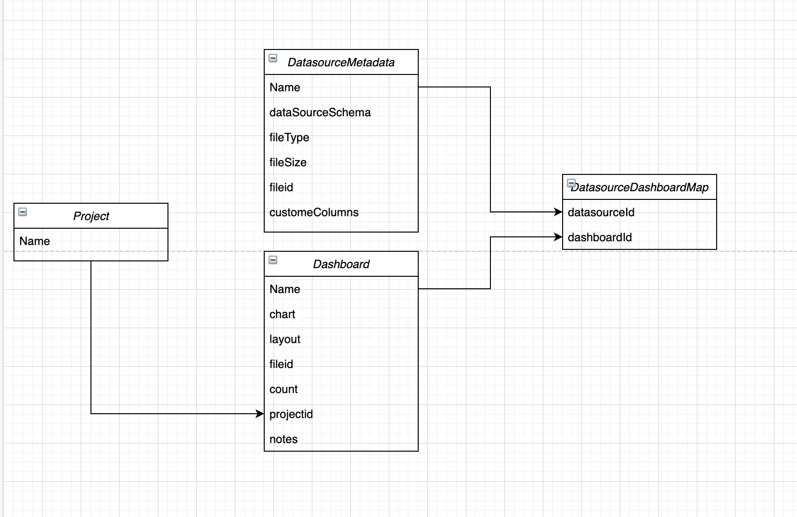

# BharatSim Visualization

Visualization engine/tool would accept Simulation engine output or any csv data file and would help users to visualize it by means of creating different graphs and charts. The tool allows user to visualize data using Line chart, bar chart and histogram. Along with these basic charts, the tool supports GIS data in the geoJSON format and can plot heat map and choropleth. Furthermore, user can visualize these heat maps and choropleths across time dimension.

## Visualization engine/tool provides various abilities such as :

1. Data Import Ex. Simulation Engine output in CSV format
2. Data file Management Ex. Add, edit, delete
3. Plot charts/widgets Ex. Line, Bar charts, Histogram
4. Plot geo map Ex. Heatmap and Choropleth
5. Project & Dashboard management Ex. Add, edit, delete
6. Auto-Save action for Dashboards
7. Widget management & it's configuration
8. Export widget (PNG, SVG)

## Tech Stack

### Frontend

- React
- React-Redux
- Redux-Saga
- Material UI
- Jest
- React Testing Library

### Backend

- Node.Js
- Express
- Mongoose
- MongoDB
- Jest

## Setup and Start application

- [Deployment Setup](#deployment-setup) - when user only want to use application, one time setup
- [Development setup with docker](#development-setup-with-docker) - when user want to do small changes and use application
- [Development setup without docker](#development-setup-without-docker) - for developers

### Deployment Setup

- Prerequisites
  - Docker
    https://www.docker.com/products/docker-desktop
    <br/> Docker Resources - Memory >= 8 GB
  - NodeJs version >= 14.15.0 https://nodejs.org/en/download/
- Code setup

  1. Clone the repository
     `https://github.com/debayanLab/BharatSim-Visualisation`
  2. Setup `.env` file \
     Change below values as per convenience <br/>
     After changing username and password, delete `data` folder

     ```
      DB_USER=bharatsim_user
      DB_PASS=password
      DB_PORT=27017
      #  for development only
      #DB_HOST=localhost
      DB_HOST=mongodb
      MONGO_INITDB_ROOT_USERNAME=root
      MONGO_INITDB_ROOT_PASSWORD=password
      APP_PORT=3005

     ```

  3. Run `yarn install`
  4. Run `yarn deep-clean` to cleanup node_modules, cache and unused file and folders
  5. Run the code `docker-compose up`
  6. Access application on `http://localhost:3005/` or `http://127.0.0.1:3005/`

### Development setup with docker

- Prerequisites
  - Docker
    https://www.docker.com/products/docker-desktop
    <br/> Docker Resources - Memory >= 8 GB
  - NodeJs version >= 14.15.0 https://nodejs.org/en/download/
- Step to start application

  1. Clone the repository
     `https://github.com/debayanLab/BharatSim-Visualisation`
  2. Setup `.env` file \
     we are using same `.env` file production and development setup with docker <br/>
     Change below values as per convenience <br/>
     After changing username and password, delete `dev-data` folder

     ```
      DB_USER=bharatsim_user
      DB_PASS=password
      DB_PORT=27017
      DB_HOST=mongodb
      MONGO_INITDB_ROOT_USERNAME=root
      MONGO_INITDB_ROOT_PASSWORD=password
      APP_PORT=3005

     ```

  3. Run `yarn install`
  4. Run `yarn deep-clean` to cleanup node_modules, cache and unused file and folders

  5. Run the code `docker-compose -f docker-compose.dev.yml up`
  6. Access application on `http://localhost:3005/` or `http://127.0.0.1:3005/`

### Development setup without docker

- Prerequisites
  - MongoDb version >= 4
    <br>https://docs.mongodb.com/manual/administration/install-community/
  - NodeJs version >= 14.15.0 https://nodejs.org/en/download/
- Step to start application
  1. Clone the repository
     `https://github.com/debayanLab/BharatSim-Visualisation`
  2. Start mongo service and check mongodb has root user, if not create one.
     ```
     use admin
     db.createUser(
      {
          user: "root",
          pwd: "password",
          roles: [ "root" ]
      })
     ```
  3. Setup `dev.env` file \
     Change below values as per convenience <br/>
     ```
      DB_USER=bharatsim_user
      DB_PASS=password
      DB_PORT=27017
      DB_HOST=localhost
      MONGO_INITDB_ROOT_USERNAME=root
      MONGO_INITDB_ROOT_PASSWORD=password
      APP_PORT=3005
     ```
  4. Install node modules for root `yarn install`
  5. Install node modules for a frontend and backend `yarn install-deps`
  6. For single terminal window
     `yarn dev`
     <br/> OR <br/>
     For separate window of frontend and backend<br>
     Frontend - `yarn dev-frontend` <br/>
     Backend - `yarn dev-backend`

<br/>

# Development Documentation

We used the MERN stack to build the BharatSim Visualization app.

## OverView

Application has two basic components

- Frontend - a frontend is build using react and we are using material-UI as a component library.
- Backend - a backend written in javascript using node and express which contains a REST API as well as all the relevant code for talking to databases and processing queries. \

Frontend minified build is merge with backend while creating a deployment build and then we used docker to the containerised whole build into a single docker image.

## 3rd party dependencies

We are using lots of 3rd party dependencies. so while developing keep them up to date. for both the component you have to fetch these dependencies using `yarn`

## Application level scripts

`yarn install-deps` - install 3rd party Dependencies for root level, frontend, backend

`yarn build` - create production build

`yarn start` - start production backend server with frontend minified build

`yarn dev` - start development server

`yarn dev-frontend` - start frontend development server

`yarn dev-backend` - start backend development server

`yarn test` - run tests for frontend and backend

`yarn clean` - clean build folder and node_modules

`yarn deep-clean` - clean build folder, node_modules and cache

# Frontend

Frontend application is created using `create-react-app` script and for build processes we are using `react-scripts`.

## Tech stack

- React \
   React is an open-source front-end JavaScript library for building user interfaces or UI components. It is maintained by Facebook and a community of individual developers and companies. React can be used as a base in the development of single-page or mobile applications\
   https://reactjs.org/

- React-Redux \
   Redux is an open-source JavaScript library for managing application state. It is most commonly used with libraries such as React or Angular for building user interfaces. Similar to Facebook's Flux architecture.\
   https://react-redux.js.org/

- Redux-Saga \
   react-saga is an attempt to make data / logic dependencies declarative in the same way as UI
  https://redux-saga.js.org/

- Material UI \
   React components for faster and easier web development. Build your own design system, or start with Material Design. \  
  https://material-ui.com/

- Jest \
  Jest is a JavaScript testing framework maintained by Facebook, Inc. with a focus on simplicity. \
  https://jestjs.io/

- React Testing Library \
   The React Testing Library is a very lightweight solution for testing React components \
   https://testing-library.com/docs/react-testing-library/intro/

- Prettier and eslint \
  for maintaining code formatting and coding pattern in code. we are using `eslint-config-airbnb` in eslint and code formatting check `frontend/.prettierrc` file.

## scripts

we can use standards `yarn` scripts to `install, update and delete` 3rd party dependencies.

`yarn start` - start development server

`yarn build` - create production build

`yarn test` - run all tests

`yarn lint` - check linting error

`yarn format` - check formatting for prettier

`yarn fix` - fix linting and prettier errors

### Design concept

We created application design prototype using Figma and we also created custom theme for material ui design system.

Prototypes \
https://www.figma.com/file/SuEeiAtvlLB1vLfg2BaSOZ/BharatSim_High-Fidelity-Wireframe

Theme \
https://www.figma.com/file/SuEeiAtvlLB1vLfg2BaSOZ/BharatSim_High-Fidelity-Wireframe?node-id=1%3A2

Logo \
https://www.figma.com/file/YdI8NTSFx4flelbyBphTiO/BharatSim_logo_final?node-id=0%3A1

### Folder structure

<pre>

frontend/  ................... -- FRONTEND  --
├─ public/  .................. Setup folder for react
└─ src/  ..................... 
 ├─ App.js  ................ 
 ├─ AppRoute.js  ........... 
 ├─ commanPropTypes.js  .... 
 ├─ globalSetup.js  ........ 
 ├─ index.css  ............. 
 ├─ index.js  .............. Entry point of frontend 
 ├─ setupProxy.js  ......... proxy setup for dev mode 
 ├─ setupTests.js  ......... Setup for test
 ├─ testUtil.js  ........... Utility for test 
 ├─ assets/  ............... Images/font 
 ├─ config/  ............... 
 ├─ constants/  ............ 
 ├─ contexts/  ............. 
 ├─ hoc/  ..................
 ├─ hook/  ................. 
 ├─ modules/  .............. Each module is like one features  
 │  ├─ home/ ............... Test Structure - within same folder we will 
 │  │  ├─ Home.js .......... __test__ folder, which will content test for  
 │  │  └─ __tests__/ ....... each file present in folder with filename
 │  |    ├─ Home.test.js ..  filename.test.js
 ├─ theme/  ................ 
 ├─ uiComponent/  .......... Reusable components across whole app
 └─ utils/  ................ 
</pre>

### Testing

we can run all test using `yarn test` and for specific tests add test name or filename in front of command for ex.
`yarn test <file name/ test name/ foldername >`

Folder structure - test file will reside in `__test__` folder of each component folder and name of test file is
formatted as `<ComponentFileName>.test.js`

```
 home/ ..................
 |  |─ __tests__/ .......
 |  |  |─ Home.test.js ..
 |  |─ Home.js ..........

```

# Backend

Backed application is created using node and express. For hot reloading we added nodemon in development script

## Tech stack

- Node \
   Node.js is an open-source, cross-platform, back-end JavaScript runtime environment that runs on the V8 engine and executes JavaScript code outside a web browser\
   https://nodejs.org

- Express \
  Express.js, or simply Express, is a back end web application framework for Node.js, released as free and open-source software under the MIT License. It is designed for building web applications and APIs\
   https://expressjs.com/

- Mongoose\
  Mongoose provides a straight-forward, schema-based solution to model your application data. It includes built-in type casting, validation, query building, business logic hooks and more, out of the box.
  https://mongoosejs.com/

- Multer \
  Multer is a node.js middleware for handling multipart/form-data, which is primarily used for uploading files. It is written on top of busboy for maximum efficiency.
  https://github.com/expressjs/multer

- Jest \
  Jest is a JavaScript testing framework maintained by Facebook, Inc. with a focus on simplicity. \
  https://jestjs.io/

- MongoDB \
   MongoDB is a source-available cross-platform document-oriented database program. Classified as a NoSQL database program, MongoDB uses JSON-like documents with optional schemas. \
   https://www.mongodb.com/ \
   http://mongodb.github.io/node-mongodb-native/3.6/api/

- Prettier and eslint \
  for maintaining code formatting and coding pattern in code. we are using `eslint-config-airbnb` in eslint and code formatting check `frontend/.prettierrc` file.

## scripts

we can use standards `yarn` scripts to `install, update and delete` 3rd party dependencies.

`yarn start` - start development server

`yarn start:prod` - start production server

`yarn start-db` - start database

`yarn test` - run all tests

`yarn lint` - check linting error

`yarn format` - check formatting for prettier

`yarn fix` - fix linting and prettier errors

### folder structure

<pre>
backend/ ..................... -- BACKEND --
├─ app.js  ...................
├─ public/  .................. Content frontend minified build 
├─ src/  ..................... 
│  ├─ constants/  ............ 
│  ├─ controller/  ........... 
│  ├─ exceptions/  ........... 
│  ├─ model/  ................ 
│  ├─ repository/  ........... 
│  ├─ services/  .............
│  └─ utils/  ................ 
├─ test/ ..................... Test structure - for each folder
│  ├─ controller/ ............ we will have holder inside test folder 
│  │  ├─ SetupTestClient.js .. content test for each file with file name format filename.test.js
└─ uploads/  ................. Contend uploaded file in dev mode 
</pre>

### Database



### Testing

we can run all test using `yarn test` and for specific tests add test name or filename in front of command for ex.
`yarn test <file name/ test name/ foldername >`

Folder structure - test file will reside in global `test` folder. This `test` folder will contain similar structure as src folder and contain test file with filename formatted as `<fileName>.test.js`

```
 home/ ..................
 |- Home.js .............
 test/ ..................
 |- home/ ...............
 |  |- Home.test.js .....

```
